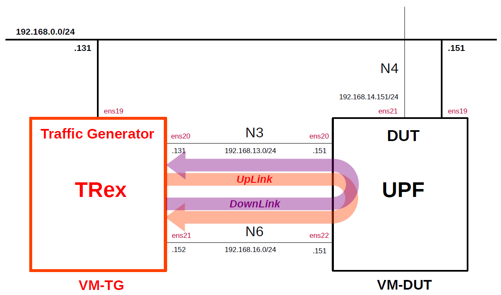

# Install TRex
This is a simple description of the procedure to install the traffic generator [TRex](https://github.com/cisco-system-traffic-generator/trex-core).
The detailed documentation for TRex can be found [here](https://trex-tgn.cisco.com/trex/doc/index.html).
This is intended as a preparation for measuring the performance of open source UPFs.

---

### [Sample Configurations and Miscellaneous for Mobile Network](https://github.com/s5uishida/sample_config_misc_for_mobile_network)

---

<a id="toc"></a>

## Table of Contents

- [Simple Overview of TRex and DUT (UPF)](#overview)
- [Install TRex](#install)
- [Setup TRex](#setup)
  - [Check network devices and bus information](#check)
  - [Create configuration file](#config)
  - [Create load profiles](#load_profile)
    - [UpLink load profile](#ul_load_profile)
    - [DownLink load profile](#dl_load_profile)
  - [Create latency profiles](#latency_profile)
    - [UpLink latency profile](#ul_latency_profile)
    - [DownLink latency profile](#dl_latency_profile)
  - [Set kernel parameter](#set_param)
- [Run TRex](#run)
  - [UpLink measurement](#ul_measurement)
    - [UpLink load measurement](#ul_load_measurement)
    - [UpLink latency measurement](#ul_latency_measurement)
  - [DownLink measurement](#dl_measurement)
    - [DownLink load measurement](#dl_load_measurement)
    - [DownLink latency measurement](#dl_latency_measurement)
- [How to capture packets on DPDK ports](#pcap)
- [Sample Configurations](#sample_conf)
- [Changelog (summary)](#changelog)

---

<a id="overview"></a>

## Simple Overview of TRex and DUT (UPF)

This describes a simple configuration of TRex and DUT (UPF).
**Note that this configuration is implemented with Proxmox VE VMs.**

The following minimum configuration was set as a condition.
- One TRex and DUT (UPF)

The built simulation environment is as follows.

</img>

The TRex used is as follows.
- TRex v3.08 (2025.11.05) - https://github.com/cisco-system-traffic-generator/trex-core
- Scapy v2.6.1 (2024.11.05) - https://github.com/secdev/scapy

Each VMs are as follows.  
| VM | SW & Role | IP address | OS | CPU<br>(Min) | Mem<br>(Min) | HDD<br>(Min) |
| --- | --- | --- | --- | --- | --- | --- |
| VM-TG | TRex<br>Traffic Generator | 192.168.0.131/24 | Ubuntu 24.04 | 3 | 8GB | 10GB |
| VM-DUT | each UPF DUT<br>(Device Under Test) | 192.168.0.151/24 | Ubuntu 24.04<br>or 22.04 | 2 | 8GB | 10GB |

The network interfaces of each VM are as follows.
| VM | Device | Model | Linux Bridge | IP address | Interface | Under<br>DPDK |
| --- | --- | --- | --- | --- | --- | --- |
| VM-TG | ens18 | VirtIO | vmbr1 | 10.0.0.131/24 | (NAPT NW) | -- |
| | ens19 | VirtIO | mgbr0 | 192.168.0.131/24 | (Mgmt NW) | -- |
| | ens20 | VirtIO | vmbr3 | 192.168.13.131/24 | N3 | x |
| | ens21 | VirtIO | vmbr6 | 192.168.16.152/24 | N6 | x |
| VM-DUT | ~~ens18~~ | ~~VirtIO~~ | ~~vmbr1~~ | ~~10.0.0.151/24~~ | ~~(NAPT NW)~~ ***down*** | -- |
| | ens19 | VirtIO | mgbr0 | 192.168.0.151/24 | (Mgmt NW) | -- |
| | ens20 | VirtIO | vmbr3 | 192.168.13.151/24 | N3 | -- |
| | ens21 | VirtIO | vmbr4 | 192.168.14.151/24 | N4 | -- |
| | ens22 | VirtIO | vmbr6 | 192.168.16.151/24 | N6 | -- |

Linux Bridges of Proxmox VE are as follows.
| Linux Bridge | Network CIDR | Interface |
| --- | --- | --- |
| vmbr1 | 10.0.0.0/24 | NAPT NW |
| mgbr0 | 192.168.0.0/24 | Mgmt NW |
| vmbr3 | 192.168.13.0/24 | N3 |
| vmbr4 | 192.168.14.0/24 | N4 |
| vmbr6 | 192.168.16.0/24 | N6 |

UE IP address and TEID are as follows.
| UE IP address | UpLink TEID | DownLink TEID |
| --- | --- | --- |
| 10.45.0.2/24 | 0x00000001 | 0x00000002 |

<a id="install"></a>

## Install TRex

Please refer to the following for installing TRex.
- TRex v3.08 (2025.11.05) - https://github.com/cisco-system-traffic-generator/trex-core/wiki

This section explains how to install TRex v3.08 to `/opt/trex` directory.
This time, for using the PDU Session container in the GTP-U packet header, I will replace `gtp.py` and `gtp_v2.py` of Scapy v2.4.3 included in TRex v3.08 with those of Scapy v2.6.1.

First, download the pre-built TRex v3.08 binaries and extract it to `/opt/trex` directory.
```
# cd /opt
# wget --no-check-certificate https://trex-tgn.cisco.com/trex/release/v3.08.tar.gz
# tar xfvz v3.08.tar.gz 
# mv v3.08 trex
```
Then, for using the PDU Session container in the GTP-U packet header, replace `gtp.py` and `gtp_v2.py` of Scapy v2.4.3 included in TRex v3.08 with those of Scapy v2.6.1.
```
# wget https://raw.githubusercontent.com/secdev/scapy/refs/tags/v2.6.1/scapy/contrib/gtp.py -O /opt/trex/external_libs/scapy-2.4.3/scapy/contrib/gtp.py
# wget https://raw.githubusercontent.com/secdev/scapy/refs/tags/v2.6.1/scapy/contrib/gtp_v2.py -O /opt/trex/external_libs/scapy-2.4.3/scapy/contrib/gtp_v2.py
```

<a id="setup"></a>

## Setup TRex

<a id="check"></a>

### Check network devices and bus information

First, check the network devices and bus information of the installation machine.
```
# lshw -c network -businfo
Bus info          Device      Class      Description
====================================================
pci@0000:00:12.0              network    Virtio network device
virtio@1          ens18       network    Ethernet interface
pci@0000:00:13.0              network    Virtio network device
virtio@2          ens19       network    Ethernet interface
pci@0000:00:14.0              network    Virtio network device
virtio@3          ens20       network    Ethernet interface
pci@0000:00:15.0              network    Virtio network device
virtio@4          ens21       network    Ethernet interface
```
In my environment, based on this information, configure `pci@0000:00:14.0` of `ens20`(N3) and `pci@0000:00:15.0` of `ens21`(N6).

<a id="config"></a>

### Create configuration file

Use the following `dpdk_setup_ports.py` script to create `/etc/trex_cfg.yaml` with the IP settings for the ports used by DPDK.
```
# cd /opt/trex
# ./dpdk_setup_ports.py -i
...
```
I edited this file created as follows.

`/etc/trex_cfg.yaml`
```yaml
### Config file generated by dpdk_setup_ports.py ###

- version: 2
  interfaces: ['00:14.0', '00:15.0']
  port_info:
      - ip: 192.168.13.131
        default_gw: 192.168.13.151
      - ip: 192.168.16.152
        default_gw: 192.168.16.151

  platform:
      master_thread_id: 0
      latency_thread_id: 1
      dual_if:
        - socket: 0
          threads: [2]

```

<a id="load_profile"></a>

### Create load profiles

I am using the following for the TRex load profile.
Also, the payload size is set to 1400 bytes and the QFI is set to 1.

<a id="ul_load_profile"></a>

#### UpLink load profile

Create `gtp_1pkt_simple.py` for UpLink load profile in `/opt/trex/stl` directory and set the following parameters.

| Item | Value (my environment) |
| --- | --- |
| GNB_IP_V4 | "192.168.13.131" |
| N3_IP_V4 | "192.168.13.151" |
| UE_IP_V4 | "10.45.0.2" |
| DN_IP_V4 | "192.168.16.152" |
| UL_TEID | 0x00000001 |

`/opt/trex/stl/gtp_1pkt_simple.py`
```py
from trex_stl_lib.api import *
from scapy.contrib.gtp import GTP_U_Header, GTPPDUSessionContainer
import argparse

GNB_IP_V4 = "192.168.13.131"
N3_IP_V4 = "192.168.13.151"
UE_IP_V4 = "10.45.0.2"
DN_IP_V4 = "192.168.16.152"
UL_TEID = 0x00000001

class STLS1(object):

    def create_stream (self):
        return STLStream(
            packet =
                    STLPktBuilder(
                        pkt = Ether()/IP(src=GNB_IP_V4,dst=N3_IP_V4,version=4)/
                                UDP(dport=2152,sport=2152)/
                                GTP_U_Header(teid=UL_TEID)/
                                GTPPDUSessionContainer(type=1,QFI=1)/
                                IP(src=UE_IP_V4,dst=DN_IP_V4,version=4)/
                                UDP(dport=1234,sport=1234)/
                                (1400*'x')
                    ),
             mode = STLTXCont())

    def get_streams (self, tunables, **kwargs):
        parser = argparse.ArgumentParser(description='Argparser for {}'.format(os.path.basename(__file__)),
                                         formatter_class=argparse.ArgumentDefaultsHelpFormatter)
        args = parser.parse_args(tunables)
        # create 1 stream
        return [ self.create_stream() ]

def register():
    return STLS1()
```

<a id="dl_load_profile"></a>

#### DownLink load profile

Create `udp_1pkt_simple.py` for DownLink load profile in `/opt/trex/stl` directory and set the following parameters.

| Item | Value (my environment) |
| --- | --- |
| UE_IP_V4 | "10.45.0.2" |
| DN_IP_V4 | "192.168.16.152" |

`/opt/trex/stl/udp_1pkt_simple.py`
```py
from trex_stl_lib.api import *
import argparse

UE_IP_V4 = "10.45.0.2"
DN_IP_V4 = "192.168.16.152"

class STLS1(object):

    def create_stream (self):
        return STLStream(
            packet =
                    STLPktBuilder(
                        pkt = Ether()/IP(src=DN_IP_V4,dst=UE_IP_V4,version=4)/
                                UDP(dport=1234,sport=1234)/
                                (1400*'x')
                    ),
             mode = STLTXCont())

    def get_streams (self, tunables, **kwargs):
        parser = argparse.ArgumentParser(description='Argparser for {}'.format(os.path.basename(__file__)),
                                         formatter_class=argparse.ArgumentDefaultsHelpFormatter)
        args = parser.parse_args(tunables)
        # create 1 stream
        return [ self.create_stream() ]

def register():
    return STLS1()
```

<a id="latency_profile"></a>

### Create latency profiles

I am using the following for the TRex latency profile.
Also, the payload size is set to 1400 bytes and the QFI is set to 1.

**Note. In TRex STL mode, using STLFlowLatencyStats on a UDP packet will invalidate the UDP checksum value. The reason is that when using STLFlowLatencyStats, the last 16 bytes of the payload are rewritten. This will result in an incorrect UDP checksum value on the receiving side. Therefore, set the UDP checksum value to zero to ignore it.**  
**And for perfomance reasons, latency streams are not affected by `-m` flag when running `start` command in the trex console, so you can only change the pps value by editing the profile code. Here, `STLTXCont(pps=1)` is set in `mode` argument of `STLStream()` as follows.**
```
mode = STLTXCont(pps=1)
```

<a id="ul_latency_profile"></a>

#### UpLink latency profile

Create `gtp_latency_1pkt_simple.py` for UpLink latency profile in `/opt/trex/stl` directory and set the following parameters.

| Item | Value (my environment) |
| --- | --- |
| GNB_IP_V4 | "192.168.13.131" |
| N3_IP_V4 | "192.168.13.151" |
| UE_IP_V4 | "10.45.0.2" |
| DN_IP_V4 | "192.168.16.152" |
| UL_TEID | 0x00000001 |

`/opt/trex/stl/gtp_latency_1pkt_simple.py`
```py
from trex_stl_lib.api import *
from scapy.contrib.gtp import GTP_U_Header, GTPPDUSessionContainer
import argparse

GNB_IP_V4 = "192.168.13.131"
N3_IP_V4 = "192.168.13.151"
UE_IP_V4 = "10.45.0.2"
DN_IP_V4 = "192.168.16.152"
UL_TEID = 0x00000001

class STLS1(object):

    def create_stream (self):
        return STLStream(
            packet =
                    STLPktBuilder(
                        pkt = Ether()/IP(src=GNB_IP_V4,dst=N3_IP_V4,version=4)/
                                UDP(dport=2152,sport=2152,chksum=0)/
                                GTP_U_Header(teid=UL_TEID)/
                                GTPPDUSessionContainer(type=1,QFI=1)/
                                IP(src=UE_IP_V4,dst=DN_IP_V4,version=4)/
                                UDP(dport=1234,sport=1234)/
                                (1400*'x')
                    ),
             flow_stats = STLFlowLatencyStats(pg_id=0),
             mode = STLTXCont(pps=1))

    def get_streams (self, tunables, **kwargs):
        parser = argparse.ArgumentParser(description='Argparser for {}'.format(os.path.basename(__file__)),
                                         formatter_class=argparse.ArgumentDefaultsHelpFormatter)
        args = parser.parse_args(tunables)
        # create 1 stream
        return [ self.create_stream() ]

def register():
    return STLS1()
```

<a id="dl_latency_profile"></a>

#### DownLink latency profile

Create `udp_latency_1pkt_simple.py` for DownLink latency profile in `/opt/trex/stl` directory and set the following parameters.

| Item | Value (my environment) |
| --- | --- |
| UE_IP_V4 | "10.45.0.2" |
| DN_IP_V4 | "192.168.16.152" |

`/opt/trex/stl/udp_latency_1pkt_simple.py`
```py
from trex_stl_lib.api import *
import argparse

UE_IP_V4 = "10.45.0.2"
DN_IP_V4 = "192.168.16.152"

class STLS1(object):

    def create_stream (self):
        return STLStream(
            packet =
                    STLPktBuilder(
                        pkt = Ether()/IP(src=DN_IP_V4,dst=UE_IP_V4,version=4)/
                                UDP(dport=1234,sport=1234,chksum=0)/
                                (1400*'x')
                    ),
             flow_stats = STLFlowLatencyStats(pg_id=1),
             mode = STLTXCont(pps=1))

    def get_streams (self, tunables, **kwargs):
        parser = argparse.ArgumentParser(description='Argparser for {}'.format(os.path.basename(__file__)),
                                         formatter_class=argparse.ArgumentDefaultsHelpFormatter)
        args = parser.parse_args(tunables)
        # create 1 stream
        return [ self.create_stream() ]

def register():
    return STLS1()
```

<a id="set_param"></a>

### Set kernel parameter

Set `vm.nr_hugepages` to 1024.
```
# sysctl vm.nr_hugepages=1024
```
Then mount the HugePages as `hugetlbfs`(HugeTLB) file system.
```
# mkdir -p /mnt/huge
# mount -t hugetlbfs nodev /mnt/huge
```

<a id="run"></a>

## Run TRex

**Please configure and start the DUT (UPF in my environment) in advance.**  
For information on how to use the TRex console, see [here](https://trex-tgn.cisco.com/trex/doc/trex_console.html).

First, start the TRex server.
```
# cd /opt/trex
# ./t-rex-64 -i --no-scapy-server
```
Then, open another terminal and connect to the TRex server to check the status of each port.
```
# cd /opt/trex
# ./trex-console
...
trex>
```
```
trex>portattr 
Port Status

     port       |          0           |          1           
----------------+----------------------+---------------------
driver          |      net_virtio      |      net_virtio      
description     |  Virtio network dev  |  Virtio network dev  
link status     |          UP          |          UP          
link speed      |       200 Gb/s       |       200 Gb/s       
port status     |         IDLE         |         IDLE         
promiscuous     |         off          |         off          
multicast       |         off          |         off          
flow ctrl       |         N/A          |         N/A          
vxlan fs        |          -           |          -           
--              |                      |                      
layer mode      |         IPv4         |         IPv4         
src IPv4        |    192.168.13.131    |    192.168.16.152    
IPv6            |         off          |         off          
src MAC         |  bc:24:11:51:b6:55   |  bc:24:11:18:b4:63   
---             |                      |                      
Destination     |    192.168.13.151    |    192.168.16.151    
ARP Resolution  |  bc:24:11:4a:0c:dc   |  bc:24:11:42:ed:8e   
----            |                      |                      
VLAN            |          -           |          -           
-----           |                      |                      
PCI Address     |     0000:00:14.0     |     0000:00:15.0     
NUMA Node       |          -1          |          -1          
RX Filter Mode  |    hardware match    |    hardware match    
RX Queueing     |         off          |         off          
Grat ARP        |  every 120 seconds   |  every 120 seconds   
------          |                      |                      

trex>
```
Switch ports: `[0, 1]` into service mode and ping to the IP addresses (`192.168.13.151` and `192.168.16.151`) of the DUT.
```
trex>service

Enabling service mode on port(s): [0, 1]                     [SUCCESS]

10.62 [ms]

trex(service)>
```
```
trex(service)>ping -p 0 -d 192.168.13.151 -n 3

Pinging 192.168.13.151 from port 0 with 64 bytes of data:    
Reply from 192.168.13.151: bytes=64, time=2.00ms, TTL=64
Reply from 192.168.13.151: bytes=64, time=1.26ms, TTL=64
Reply from 192.168.13.151: bytes=64, time=2.61ms, TTL=64
trex(service)>
```
```
trex(service)>ping -p 1 -d 192.168.16.151 -n 3

Pinging 192.168.16.151 from port 1 with 64 bytes of data:    
Reply from 192.168.16.151: bytes=64, time=33.58ms, TTL=64
Reply from 192.168.16.151: bytes=64, time=1.84ms, TTL=64
Reply from 192.168.16.151: bytes=64, time=3.05ms, TTL=64
trex(service)>
```
Once confirmed that ping works, the service mode exit.
```
trex(service)>service --off

Disabling service mode on port(s): [0, 1]                    [SUCCESS]

7.59 [ms]

trex>
```
Then, apply traffic to the DUT.

<a id="ul_measurement"></a>

### UpLink measurement

<a id="ul_load_measurement"></a>

#### UpLink load measurement

In the following example, use the load profile [`gtp_1pkt_simple.py`](#ul_load_profile) to apply GTP-U traffic to the DUT at 150 Kpps for 60 seconds **via port 0**.
```
trex>start -f stl/gtp_1pkt_simple.py -p 0 -m 150kpps -d 60
```
To check the traffic statistics, type `tui` in the TRex console to switch the view.
```
trex>tui
```
Below are some sample statistics. According to this, 626.15 Mbps of 1.79 Gbps was dropped, and 1.16 Gbps was received.
```
Global Statistics

connection   : localhost, Port 4501                       total_tx_L2  : 1.79 Gbps                      
version      : STL @ v3.08                                total_tx_L1  : 1.81 Gbps                      
cpu_util.    : 1.81% @ 1 cores (1 per dual port)          total_rx     : 1.16 Gbps                      
rx_cpu_util. : 0.18% / 100.57 Kpps                        total_pps    : 150.13 Kpps                    
async_util.  : 0% / 10.01 bps                             drop_rate    : 626.15 Mbps                    
total_cps.   : 0 cps                                      queue_full   : 15,046 pkts                    

Port Statistics

   port    |         0         |         1         |       total       
-----------+-------------------+-------------------+------------------
owner      |              root |              root |                   
link       |                UP |                UP |                   
state      |      TRANSMITTING |              IDLE |                   
speed      |          200 Gb/s |          200 Gb/s |                   
CPU util.  |             1.81% |              0.0% |                   
--         |                   |                   |                   
Tx bps L2  |         1.79 Gbps |             0 bps |         1.79 Gbps 
Tx bps L1  |         1.81 Gbps |             0 bps |         1.81 Gbps 
Tx pps     |       150.13 Kpps |             0 pps |       150.13 Kpps 
Line Util. |            0.91 % |               0 % |                   
---        |                   |                   |                   
Rx bps     |             0 bps |         1.16 Gbps |         1.16 Gbps 
Rx pps     |             0 pps |       100.57 Kpps |       100.57 Kpps 
----       |                   |                   |                   
opackets   |           3727565 |                 1 |           3727566 
ipackets   |                 0 |           2451753 |           2451753 
obytes     |        5554071850 |                46 |        5554071896 
ibytes     |                 0 |        3545233438 |        3545233438 
tx-pkts    |        3.73 Mpkts |            1 pkts |        3.73 Mpkts 
rx-pkts    |            0 pkts |        2.45 Mpkts |        2.45 Mpkts 
tx-bytes   |           5.55 GB |              46 B |           5.55 GB 
rx-bytes   |               0 B |           3.55 GB |           3.55 GB 
-----      |                   |                   |                   
oerrors    |                 0 |                 0 |                 0 
ierrors    |                 0 |                 0 |                 0 

status:  \

Press 'ESC' for navigation panel...
status: 

tui>
```

<a id="ul_latency_measurement"></a>

#### UpLink latency measurement

In the following example, use the latency profile [`gtp_latency_1pkt_simple.py`](#ul_latency_profile) to apply GTP-U traffic to the DUT at 1 pps for 10 seconds **via port 0**.
```
trex>start -f stl/gtp_latency_1pkt_simple.py -p 0 -d 10
```
To check the latency statistics, type `stats -l` in the TRex console.
```
trex>stats -l
```
Below are some sample statistics. According to this, The average latency is 0.285 (msec), the maximum is 0.307 (msec), and the minimum is 0.256 (msec).
```
Latency Statistics

   PG ID     |       0        
-------------+---------------
TX pkts      |             11 
RX pkts      |             11 
Max latency  |            307 
Min latency  |            256 
Avg latency  |            285 
-- Window -- |                
Last max     |            279 
Last-1       |                
Last-2       |                
Last-3       |                
Last-4       |                
Last-5       |                
Last-6       |                
Last-7       |                
Last-8       |                
Last-9       |                
Last-10      |                
Last-11      |                
Last-12      |                
Last-13      |                
---          |                
Jitter       |             20 
----         |                
Errors       |              0 

trex>
```

<a id="dl_measurement"></a>

### DownLink measurement

<a id="dl_load_measurement"></a>

#### DownLink load measurement

In the following example, use the load profile [`udp_1pkt_simple.py`](#dl_load_profile) to apply UDP traffic to the DUT at 150 Kpps for 60 seconds **via port 1**.
```
trex>start -f stl/udp_1pkt_simple.py -p 1 -m 150kpps -d 60
```
To check the traffic statistics, type `tui` in the TRex console to switch the view.
```
trex>tui
```
Below are some sample statistics. According to this, 671.65 Mbps of 1.73 Gbps was dropped, and 1.06 Gbps was received.
```
Global Statistics

connection   : localhost, Port 4501                       total_tx_L2  : 1.73 Gbps                      
version      : STL @ v3.08                                total_tx_L1  : 1.75 Gbps                      
cpu_util.    : 2.36% @ 1 cores (1 per dual port)          total_rx     : 1.06 Gbps                      
rx_cpu_util. : 0.06% / 89.04 Kpps                         total_pps    : 149.32 Kpps                    
async_util.  : 0% / 8.26 bps                              drop_rate    : 671.65 Mbps                    
total_cps.   : 0 cps                                      queue_full   : 67,608 pkts                    

Port Statistics

   port    |         0         |         1         |       total       
-----------+-------------------+-------------------+------------------
owner      |              root |              root |                   
link       |                UP |                UP |                   
state      |              IDLE |      TRANSMITTING |                   
speed      |          200 Gb/s |          200 Gb/s |                   
CPU util.  |              0.0% |             2.36% |                   
--         |                   |                   |                   
Tx bps L2  |             0 bps |         1.73 Gbps |         1.73 Gbps 
Tx bps L1  |             0 bps |         1.75 Gbps |         1.75 Gbps 
Tx pps     |             0 pps |       149.32 Kpps |       149.32 Kpps 
Line Util. |               0 % |            0.88 % |                   
---        |                   |                   |                   
Rx bps     |         1.06 Gbps |             0 bps |         1.06 Gbps 
Rx pps     |        89.04 Kpps |             0 pps |        89.04 Kpps 
----       |                   |                   |                   
opackets   |                 1 |           6083347 |           6083348 
ipackets   |           3453893 |                 0 |           3453893 
obytes     |                46 |        8796519762 |        8796519808 
ibytes     |        5118667990 |                 0 |        5118667990 
tx-pkts    |            1 pkts |        6.08 Mpkts |        6.08 Mpkts 
rx-pkts    |        3.45 Mpkts |            0 pkts |        3.45 Mpkts 
tx-bytes   |              46 B |            8.8 GB |            8.8 GB 
rx-bytes   |           5.12 GB |               0 B |           5.12 GB 
-----      |                   |                   |                   
oerrors    |                 0 |                 0 |                 0 
ierrors    |                 0 |                 0 |                 0 

status:  -

Press 'ESC' for navigation panel...
status: 

tui>
```

<a id="dl_latency_measurement"></a>

#### DownLink latency measurement

In the following example, use the latency profile [`udp_latency_1pkt_simple.py`](#dl_latency_profile) to apply UDP traffic to the DUT at 1 pps for 10 seconds **via port 1**.
```
trex>start -f stl/udp_latency_1pkt_simple.py -p 1 -d 10
```
To check the latency statistics, type `stats -l` in the TRex console.
```
trex>stats -l
```
Below are some sample statistics. According to this, The average latency is 0.314 (msec), the maximum is 0.368 (msec), and the minimum is 0.262 (msec).
```
Latency Statistics

   PG ID     |       1        
-------------+---------------
TX pkts      |             11 
RX pkts      |             11 
Max latency  |            368 
Min latency  |            262 
Avg latency  |            314 
-- Window -- |                
Last max     |            285 
Last-1       |                
Last-2       |                
Last-3       |                
Last-4       |                
Last-5       |                
Last-6       |                
Last-7       |                
Last-8       |                
Last-9       |                
Last-10      |                
Last-11      |                
Last-12      |                
Last-13      |                
---          |                
Jitter       |             26 
----         |                
Errors       |              0 

trex>
```

<a id="pcap"></a>

## How to capture packets on DPDK ports

There are three ways to do this.

1. [How to use packet capturing feature of TRex](https://trex-tgn.cisco.com/trex/doc/trex_stateless.html)
2. [How to run `dpdk-dumpcap`](https://doc.dpdk.org/guides/howto/packet_capture_framework.html)
3. [How to run `tcpdump` or `tshark` on another VM by configuring a bridge interface linked to a network interface under DPDK control](https://github.com/s5uishida/proxmox_ve_tips#enable_promisc)

---
With the above steps, TRex has been constructed.
Although the settings differ for each UPF, I believe this has made some progress in preparing to measure open source UPFs performance using TRex.
I would like to thank the excellent developers and all the contributors of TRex.

<a id="sample_conf"></a>

## Sample Configurations

- [Simple PFCP Client](https://github.com/s5uishida/simple_pfcp_client)
- [Simple Measurement of UPF Performance 6](https://github.com/s5uishida/simple_measurement_of_upf_performance_6)
- [Simple Measurement of UPF Performance 9](https://github.com/s5uishida/simple_measurement_of_upf_performance_9)

<a id="changelog"></a>

## Changelog (summary)

- [2025.11.29] Updated TRex from v3.06 to v3.08 and the OS from Ubuntu 22.04 to 24.04.
- [2025.06.09] Added the latency measurement.
- [2025.01.31] Changed the installation method to update `gtp.py` and `gtp_v2.py` for using the PDU Session container with the pre-built TRex v3.06 binaries.
- [2025.01.16] Added the downlink measurement.
- [2024.12.08] Updated Scapy from v2.4.3 to v2.6.1 and built TRex for using the PDU Session container in the GTP-U packet header. The reason is that a proper QFI in the PDU Session container is now required when sending GTP-U packets to Open5GS UPF with the result of [this fix](https://github.com/open5gs/open5gs/commit/151275d708fc9b9b0c3af60ab40960168f9fd0a1#diff-10607d8914b6e7cbcf54fa0c2dc8d89109062d2fa3259f20a4406c87d98566f3). Please refer to [here](https://github.com/open5gs/open5gs/discussions/3593#discussioncomment-11384226) for details.
- [2024.11.03] Initial release.
