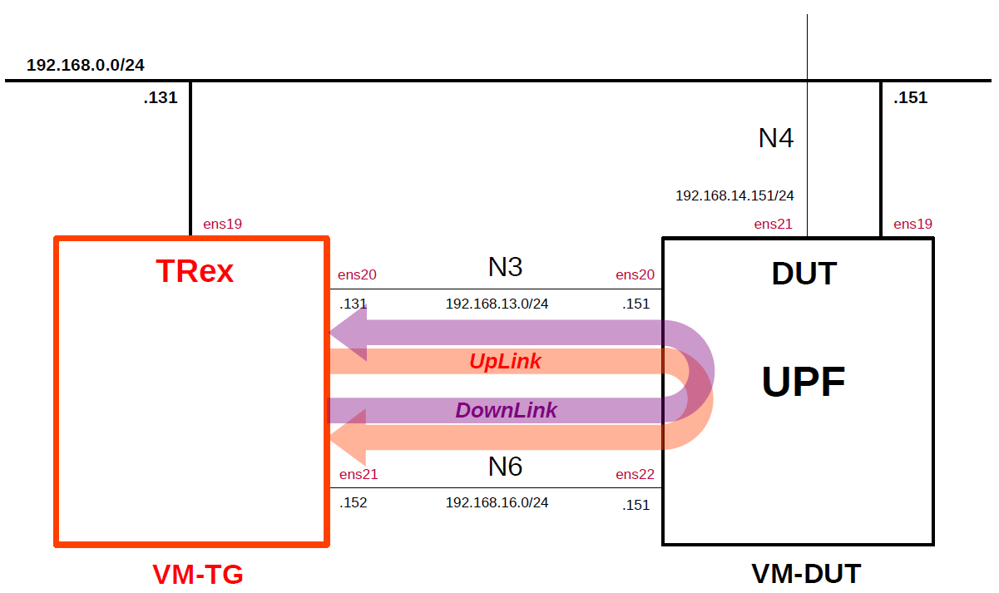

# Install TRex
This is a simple description of the procedure to install the traffic generator [TRex](https://github.com/cisco-system-traffic-generator/trex-core).
The detailed documentation for TRex can be found [here](https://trex-tgn.cisco.com/trex/doc/index.html).
This is intended as a preparation for measuring the performance of open source UPFs.

---

### [Sample Configurations and Miscellaneous for Mobile Network](https://github.com/s5uishida/sample_config_misc_for_mobile_network)

---

<a id="toc"></a>

## Table of Contents

- [Simple Overview of TRex and DUT (UPF)](#overview)
- [Install TRex](#install)
  - [Install required packages](#install_packages)
  - [Update Scapy and build TRex](#build_trex)
  - [Install TRex](#install_trex)
- [Setup TRex](#setup)
  - [Check network devices and bus information](#check)
  - [Create configuration file](#config)
  - [Create load profile](#load_profile)
  - [Set kernel parameter](#set_param)
- [Run TRex](#run)
- [Sample Configurations](#sample_conf)
- [Changelog (summary)](#changelog)

---

<a id="overview"></a>

## Simple Overview of TRex and DUT (UPF)

This describes a simple configuration of TRex and DUT (UPF).
**Note that this configuration is implemented with Proxmox VE VMs.**

The following minimum configuration was set as a condition.
- One TRex and DUT (UPF)

The built simulation environment is as follows.

</img>

The TRex used is as follows.
- TRex v3.06 (2024.09.17) - https://github.com/cisco-system-traffic-generator/trex-core
- Scapy v2.6.1 (2024.11.05) - https://github.com/secdev/scapy

Each VMs are as follows.  
| VM | SW & Role | IP address | OS | CPU<br>(Min) | Mem<br>(Min) | HDD<br>(Min) |
| --- | --- | --- | --- | --- | --- | --- |
| VM-TG | TRex<br>Traffic Generator | 192.168.0.131/24 | Ubuntu 22.04 | 3 | 8GB | 20GB |
| VM-DUT | each UPF DUT<br>(Device Under Test) | 192.168.0.151/24 | Ubuntu 24.04<br>or 22.04 | 2 | 8GB | 20GB |

The network interfaces of each VM are as follows.
| VM | Device | Model | Linux Bridge | IP address | Interface | Under<br>DPDK |
| --- | --- | --- | --- | --- | --- | --- |
| VM-TG | ens18 | VirtIO | vmbr1 | 10.0.0.131/24 | (NAPT NW) | -- |
| | ens19 | VirtIO | mgbr0 | 192.168.0.131/24 | (Mgmt NW) | -- |
| | ens20 | VirtIO | vmbr3 | 192.168.13.131/24 | N3 | x |
| | ens21 | VirtIO | vmbr6 | 192.168.16.152/24 | N6<br>***(default GW for VM-DUT)*** | x |
| VM-DUT | ~~ens18~~ | ~~VirtIO~~ | ~~vmbr1~~ | ~~10.0.0.151/24~~ | ~~(NAPT NW)~~ ***down*** | -- |
| | ens19 | VirtIO | mgbr0 | 192.168.0.151/24 | (Mgmt NW) | -- |
| | ens20 | VirtIO | vmbr3 | 192.168.13.151/24 | N3 | -- |
| | ens21 | VirtIO | vmbr4 | 192.168.14.151/24 | N4 | -- |
| | ens22 | VirtIO | vmbr6 | 192.168.16.151/24 | N6 | -- |

Linux Bridges of Proxmox VE are as follows.
| Linux Bridge | Network CIDR | Interface |
| --- | --- | --- |
| vmbr1 | 10.0.0.0/24 | NAPT NW |
| mgbr0 | 192.168.0.0/24 | Mgmt NW |
| vmbr3 | 192.168.13.0/24 | N3 |
| vmbr4 | 192.168.14.0/24 | N4 |
| vmbr6 | 192.168.16.0/24 | N6 |

UE IP address and TEID are as follows.
| UE IP address | TEID |
| --- | --- |
| 10.45.0.2/24 | 0x0000001 |

<a id="install"></a>

## Install TRex

Please refer to the following for installing TRex.
- TRex v3.06 (2024.09.17) - https://github.com/cisco-system-traffic-generator/trex-core/wiki

This section explains how to build and install TRex v3.06 to `/opt/trex` directory.
This time, build TRex using Scapy v2.6.1 instead of v2.4.3 included in TRex v3.06.

<a id="install_packages"></a>

### Install required packages

```
# apt install build-essential zlib1g-dev
```

<a id="build_trex"></a>

### Update Scapy and build TRex

First, git clone TRex v3.06 in an appropriate directory.
```
# cd ~/
# git clone https://github.com/cisco-system-traffic-generator/trex-core
```
Next, download Scapy v2.6.1 and extract it to the appropriate directory as follows.
```
# cd ~/
# wget https://github.com/secdev/scapy/archive/refs/tags/v2.6.1.tar.gz
# tar -C ~/trex-core/scripts/external_libs -zxvf v2.6.1.tar.gz
```
Next, apply [the patch](https://raw.githubusercontent.com/s5uishida/install_trex/refs/heads/main/patches/update-scapy.patch) that changes Scapy v2.4.3 to v2.6.1.
```
# cd ~/
# wget https://raw.githubusercontent.com/s5uishida/install_trex/refs/heads/main/patches/update-scapy.patch
# cd trex-core
# patch -p1 < ../update-scapy.patch
```
Then, build TRex.
```
# cd ~/trex-core/linux_dpdk
# ./b configure
# ./b build
```

<a id="install_trex"></a>

### Install TRex

Finally, install the built TRex to `/opt/trex`.
```
# cd ~/trex-core
# cp -prL scripts /opt/trex
```

<a id="setup"></a>

## Setup TRex

<a id="check"></a>

### Check network devices and bus information

First, check the network devices and bus information of the installation machine.
```
# lshw -c network -businfo
Bus info          Device      Class      Description
====================================================
pci@0000:00:12.0              network    Virtio network device
virtio@1          ens18       network    Ethernet interface
pci@0000:00:13.0              network    Virtio network device
virtio@2          ens19       network    Ethernet interface
pci@0000:00:14.0              network    Virtio network device
virtio@3          ens20       network    Ethernet interface
pci@0000:00:15.0              network    Virtio network device
virtio@4          ens21       network    Ethernet interface
```
In my environment, based on this information, configure `pci@0000:00:14.0` of `ens20`(N3) and `pci@0000:00:15.0` of `ens21`(N6).

<a id="config"></a>

### Create configuration file

Use the following `dpdk_setup_ports.py` script to create `/etc/trex_cfg.yaml` with the IP settings for the ports used by DPDK.
```
# cd /opt/trex
# ./dpdk_setup_ports.py -i
...
```
I edited this file created as follows.

`/etc/trex_cfg.yaml`
```
### Config file generated by dpdk_setup_ports.py ###

- version: 2
  interfaces: ['00:14.0', '00:15.0']
  port_info:
      - ip: 192.168.13.131
      - ip: 192.168.16.152

  platform:
      master_thread_id: 0
      latency_thread_id: 1
      dual_if:
        - socket: 0
          threads: [2]

```

<a id="load_profile"></a>

### Create load profile

I am using the following for the TRex load profile.
Also, the payload size is set to 1400 bytes and the QFI is set to 1.

`/opt/trex/stl/gtp_1pkt_simple.py`
```
from trex_stl_lib.api import *
from scapy.contrib.gtp import GTP_U_Header, GTPPDUSessionContainer
import argparse

class STLS1(object):

    def create_stream (self):
        return STLStream(
            packet =
                    STLPktBuilder(
                        pkt = Ether()/IP(src="192.168.13.131",dst="192.168.13.151")/
                                UDP(dport=2152,sport=2152)/
                                GTP_U_Header(teid=0x0000001)/
                                GTPPDUSessionContainer(type=1,QFI=1)/
                                IP(src="10.45.0.2",dst="192.168.16.152",version=4)/
                                UDP()/
                                (1400*'x')
                    ),
             mode = STLTXCont())

    def get_streams (self, tunables, **kwargs):
        parser = argparse.ArgumentParser(description='Argparser for {}'.format(os.path.basename(__file__)),
                                         formatter_class=argparse.ArgumentDefaultsHelpFormatter)
        args = parser.parse_args(tunables)
        # create 1 stream
        return [ self.create_stream() ]

def register():
    return STLS1()
```

<a id="set_param"></a>

### Set kernel parameter

Set `vm.nr_hugepages` to 2048.
```
# sysctl vm.nr_hugepages=2048
```


<a id="run"></a>

## Run TRex

**Please configure and start the DUT (UPF in my environment) in advance.**  
For information on how to use the TRex console, see [here](https://trex-tgn.cisco.com/trex/doc/trex_console.html).

First, start the TRex server.
```
# cd /opt/trex
# ./t-rex-64 -i --no-scapy-server
```
Then, open another console and apply traffic to the DUT.
In the following example, use the load profile `gtp_1pkt_simple.py` to apply GTP-U traffic to the DUT at 150 Kpps for 60 seconds.
```
# cd /opt/trex
# ./trex-console
...
trex>start -f stl/gtp_1pkt_simple.py -p 0 -m 150kpps -d 60
```
To check the traffic statistics, type `tui` in the TRex console to switch the view.
```
trex>tui
```
Below are some sample statistics. According to this, 504.81 Mbps of 1.78 Gbps was dropped, and 1.28 Gbps was received.
```
Global Statistics

connection   : localhost, Port 4501                       total_tx_L2  : 1.78 Gbps                      
version      : STL @ v3.06                                total_tx_L1  : 1.81 Gbps                      
cpu_util.    : 1.7% @ 1 cores (1 per dual port)           total_rx     : 1.28 Gbps                      
rx_cpu_util. : 0.33% / 110.52 Kpps                        total_pps    : 149.6 Kpps                     
async_util.  : 0% / 15.04 bps                             drop_rate    : 504.81 Mbps                    
total_cps.   : 0 cps                                      queue_full   : 15,516 pkts                    

Port Statistics

   port    |         0         |         1         |       total       
-----------+-------------------+-------------------+------------------
owner      |              root |              root |                   
link       |                UP |                UP |                   
state      |      TRANSMITTING |              IDLE |                   
speed      |          200 Gb/s |          200 Gb/s |                   
CPU util.  |              1.7% |              0.0% |                   
--         |                   |                   |                   
Tx bps L2  |         1.78 Gbps |             0 bps |         1.78 Gbps 
Tx bps L1  |         1.81 Gbps |             0 bps |         1.81 Gbps 
Tx pps     |        149.6 Kpps |             0 pps |        149.6 Kpps 
Line Util. |             0.9 % |               0 % |                   
---        |                   |                   |                   
Rx bps     |             0 bps |         1.28 Gbps |         1.28 Gbps 
Rx pps     |             0 pps |       110.52 Kpps |       110.52 Kpps 
----       |                   |                   |                   
opackets   |          11630198 |                 0 |          11630198 
ipackets   |                 0 |           8587873 |           8587873 
obytes     |       17328995020 |                 0 |       17328995020 
ibytes     |                 0 |       12418064358 |       12418064358 
tx-pkts    |       11.63 Mpkts |            0 pkts |       11.63 Mpkts 
rx-pkts    |            0 pkts |        8.59 Mpkts |        8.59 Mpkts 
tx-bytes   |          17.33 GB |               0 B |          17.33 GB 
rx-bytes   |               0 B |          12.42 GB |          12.42 GB 
-----      |                   |                   |                   
oerrors    |                 0 |                 0 |                 0 
ierrors    |                 0 |                 0 |                 0 

status:  |

Press 'ESC' for navigation panel...
status: 

tui>
```

---
With the above steps, TRex has been constructed.
Although the settings differ for each UPF, I believe this has made some progress in preparing to measure open source UPFs performance using TRex.
I would like to thank the excellent developers and all the contributors of TRex.

<a id="sample_conf"></a>

## Sample Configurations

- [Simple Measurement of eUPF(eBPF/XDP UPF) Performance](https://github.com/s5uishida/simple_measurement_of_eupf_performance)

<a id="changelog"></a>

## Changelog (summary)

- [2024.12.08] Updated Scapy from v2.4.3 to v2.6.1 and built TRex for using the PDU Session container in the GTP-U packet header.
- [2024.11.03] Initial release.
